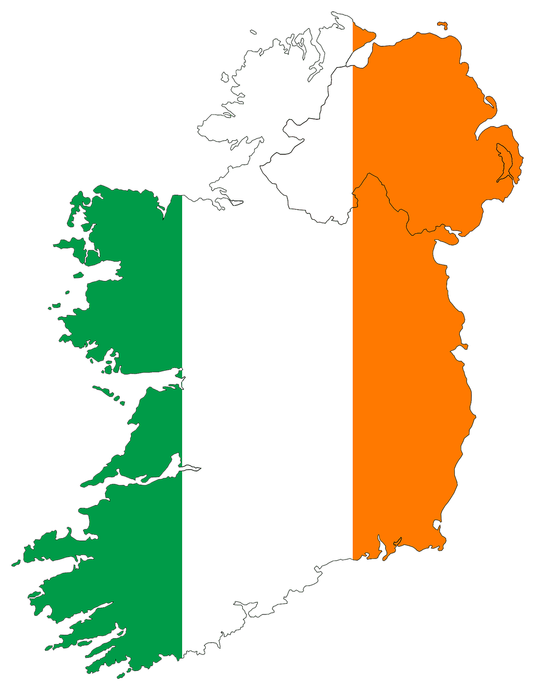

# Data Analytics Projects

## [Vivendo Food Claims Case Study](https://sadaftariq.github.io/Vivendo-Food-Claims/) 

This is a project I did for my DataCamp's Data Analyst (Associate) Certification, where I answered a number of business questions

- Data was taken from vivendo food claim dataset (the dataset was provided by datacamp)
- Utilized Excel and SQL for Data Validation and cleaning tasks before analysis
- Used SQL for exploratory data analysis Used Python for visualizations
- Successfully defended the analysis
- A report was generated and published on datacamp's workspace

## [AdventureWorksCycles Database analysis]( https://sadaftariq.github.io/Adventure-Works-Cycles/)  

This is an Interim project I did during Generation UK&I Bootcamp, where I analysed the database and answered several business problems

- Data is taken from AdventureWorksCycles database
- Utilise SQL, Python, and data analytics skills to uncover key learnings from the dataset
- Utilized visualization skills to support findings and trends in the dataset
- Created a presentation deck and clearly communicated analytical results
- A report was generated to defend the analysis

## [O-List e-commerce Dataset Analysis]( https://sadaftariq.github.io/Final_Project/)  

This is the final project I did during Generation UK&I Bootcamp, where I analysed the public dataset from Kaggel and answered several business problems

- Data is taken from olist e-commerce Brazil Dataset
- Utilise SQL, Python, Power BI and data analytics skills to uncover key learnings from the dataset
- Utilized visualization skills to support findings and trends in the dataset
- Created a Power BI report and clearly presented analytical results
- A Dashboard was created for the comprehensive view of the data

## [Ireland Homelessness Data Analysis](https://sadaftariq.github.io/HomelessnessIreland/)  

This is a Personal project I did to enhance my data anlyasis proficiency. Where I analysed the Ireland Homelessness data and created a report

- Data is taken from data.gov.ie
- Used excel for data preperation
- Used Power BI for data visualization 
- Created a report and published on Power BI Workspace

